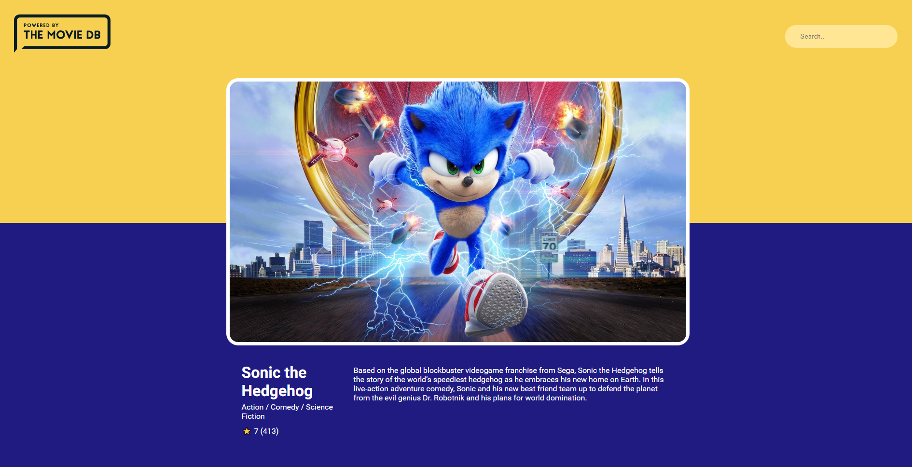

# Pokedex app

Simple pokedex app created with React and JSON-server.
[Live version](https://rafalmoneta.github.io/movie-app-react/)




## Getting Started

These instructions will get you a copy of the project up and running on your local machine for development and testing purposes. See deployment for notes on how to deploy the project on a live system.

### Installing

A step by step:

First - clone or download the repository and navigate to root directory

```
https://github.com/rafalmoneta/movie-app-react.git
```

Then install dependencies

```
npm install
```

After the installation is completed, start your react-app

```
npm run start
```

## Built With

* [create-react-app](https://github.com/facebook/create-react-app) - react starter
* [Movie DB API](https://developers.themoviedb.org/3) - movie API


## License

This project is licensed under the MIT License - see the [LICENSE.md](LICENSE.md) file for details
